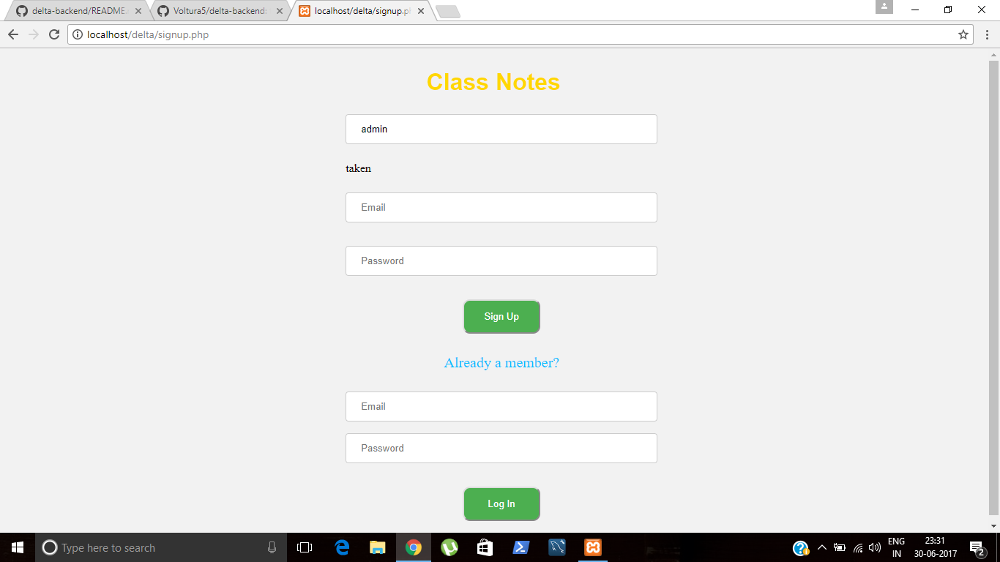
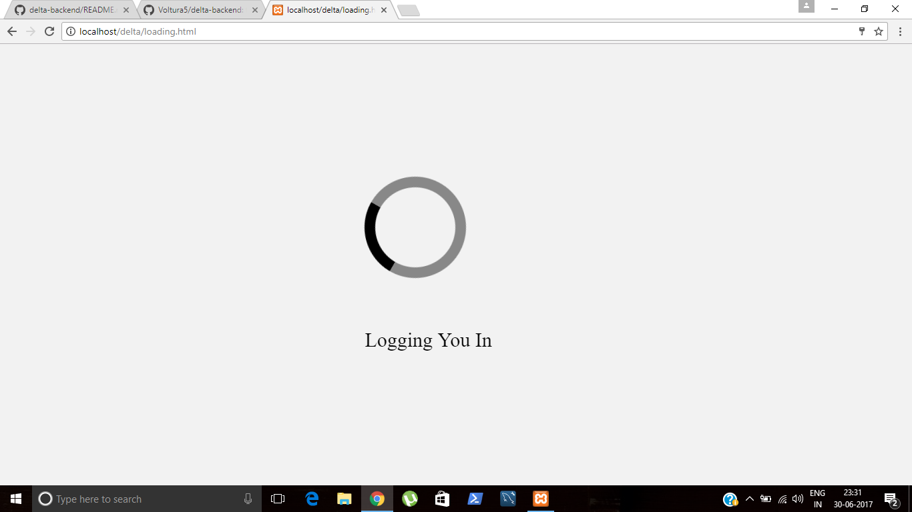
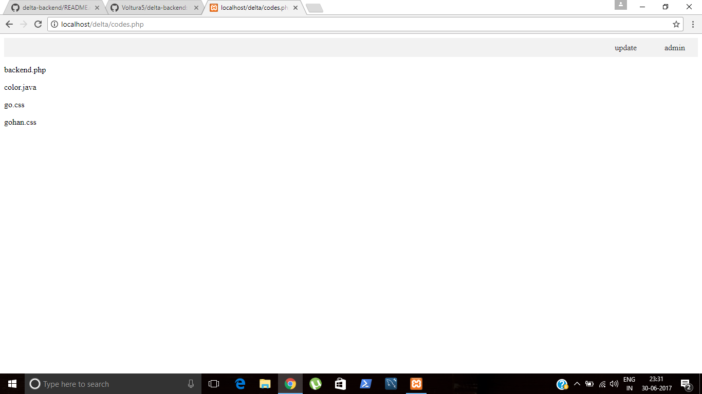
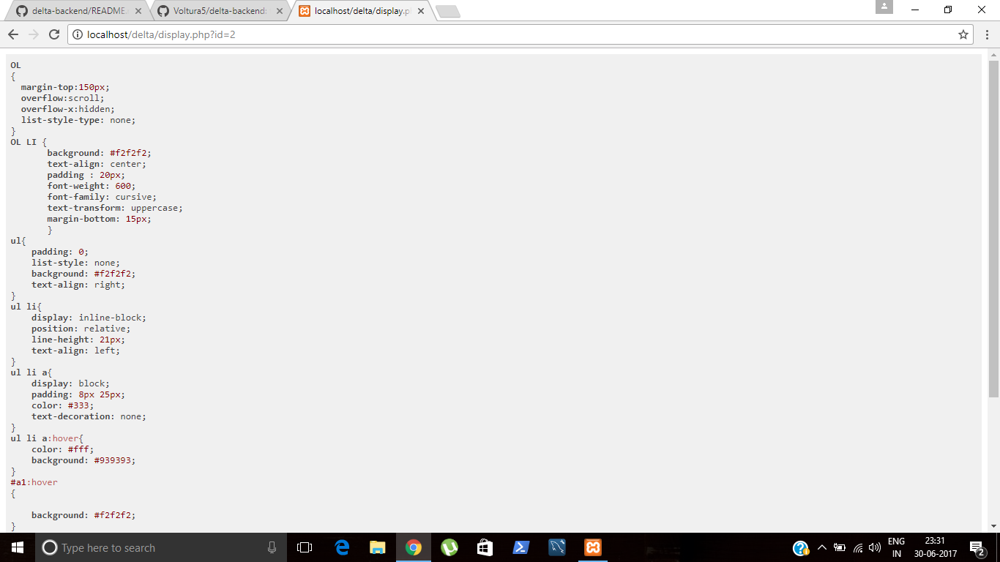
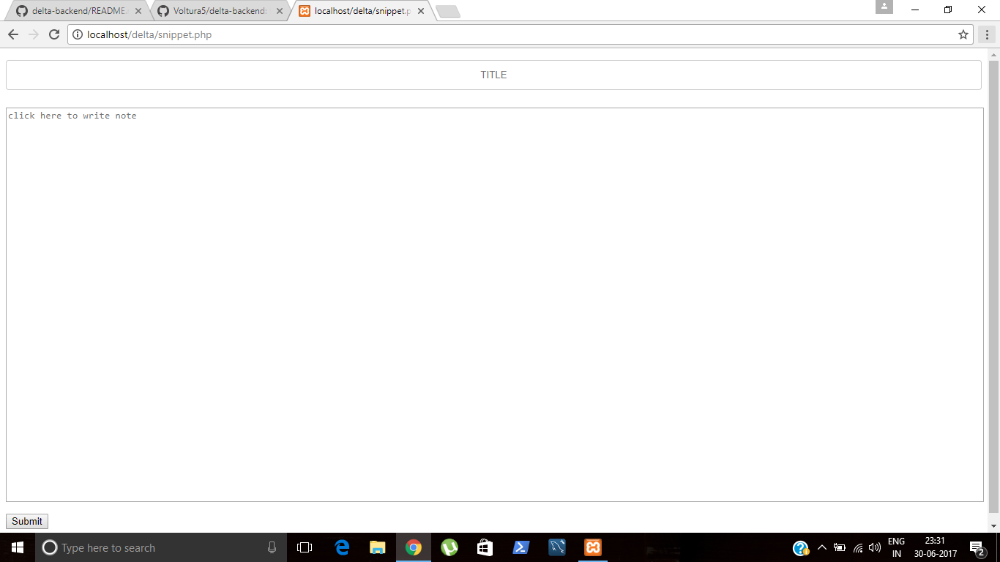

# delta-backend
this is a backend task - a site containing code snippets
## server: XAMPP
## backend language used: PHP
## query language : MySQL
database:delta
tables used: signup and code
signup table used to store details of clients
code tables used to store code snippets.

 ### [mysql](https://dev.mysql.com/downloads/workbench/).
 ### [XAMPP](https://www.apachefriends.org/download.html).

signup.php is the signup and login page to which you are rerouted if you are not logged in.
check.php checks if username isavailable or taken.
login.php checks if your email and password match the ones in database.
codes.php os the page displayed whrn you are logged in.
clicking the update displays snippet.php where you enter a new code snippet.
clicking on titles displays the code.
2.php creates the database.
3.php creates the required tables.

## Before running .php files , first start apache in XAMPP control panel.
## Also enter your username and password of MySQL in all the .php files[signup.php,login.php,codes.php,snippet.php,display.php,check.php,2.php,3.php]
 
 ### LOGIN PAGE:
 
 
 
 ### main page:
 
 ### display: 

### add code:
